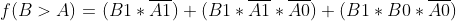
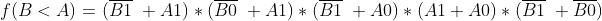

| **Dec. eq.** | **B[1:0]** | **A[1:0]** | **B > A** | **B = A** | **B < A** |
| :---: | :---: | :---: | :---: | :---: | :---: |
|   0   |  0 0  |  0 0  |   0   |   1   |   0   |
|   1   |  0 0  |  0 1  |   0   |   0   |   1   |
|   2   |  0 0  |  1 0  |   0   |   0   |   1   |
|   3   |  0 0  |  1 1  |   0   |   0   |   1   |
|   4   |  0 1  |  0 0  |   1   |   0   |   0   |
|   5   |  0 1  |  0 1  |   0   |   1   |   0   |
|   6   |  0 1  |  1 0  |   0   |   0   |   1   |
|   7   |  0 1  |  1 1  |   0   |   0   |   1   |
|   8   |  1 0  |  0 0  |   1   |   0   |   0   |
|   9   |  1 0  |  0 1  |   1   |   0   |   0   |
|   10  |  1 0  |  1 0  |   0   |   1   |   0   |
|   11  |  1 0  |  1 1  |   0   |   0   |   1   |
|   12  |  1 1  |  0 0  |   1   |   0   |   0   |
|   13  |  1 1  |  0 1  |   1   |   0   |   0   |
|   14  |  1 1  |  1 0  |   1   |   0   |   0   |
|   15  |  1 1  |  1 1  |   0   |   1   |   0   |

Karnaugh maps:

B_equals_A

|      | 00   | 01   | 11   | 10   |
| ---- | ---- | ---- | ---- | ---- |
| 00   | 1    | 0    | 0    | 0    |
| 01   | 0    | 1    | 0    | 0    |
| 11   | 0    | 0    | 1    | 0    |
| 10   | 0    | 0    | 0    | 1    |

B_greater_A

|      | 00   | 01   | 11   | 10   |
| ---- | ---- | ---- | ---- | ---- |
| 00   | 0    | 0    | 0    | 0    |
| 01   | 1    | 0    | 0    | 0    |
| 11   | 1    | 1    | 0    | 1    |
| 10   | 1    | 1    | 0    | 0    |

B_less_A

|      | 00   | 01   | 11   | 10   |
| ---- | ---- | ---- | ---- | ---- |
| 00   | 0    | 1    | 1    | 1    |
| 01   | 0    | 0    | 1    | 1    |
| 11   | 0    | 0    | 0    | 0    |
| 10   | 0    | 0    | 1    | 0    |

2 bit comparator:

https://www.edaplayground.com/x/epLw

4 bit comparator:

https://www.edaplayground.com/x/Sy4h

    architecture behavioral of comparator_4bit is
    begin
        B_less_A_o     <= '1' when (b_i < a_i) else '0';
        B_equals_A_o   <= '1' when (b_i = a_i) else '0';
        B_greater_A_o  <= '1' when (b_i > a_i) else '0';
        
    end architecture behavioral;
    
    
    p_stimulus  :  process
        begin
        
            report "Stimulus process started" severity note;
    
    
            s_b <= "0000"; s_a <= "0000"; wait for 100 ns;
            assert ((s_B_equals_A = '1') and (s_B_greater_A = '0') and (s_B_less_A = '0'))
            report "Test failed for input combination: 0000, 0000" severity error;
            
            s_b <= "0000"; s_a <= "0001"; wait for 100 ns;
            assert ((s_B_equals_A = '0') and (s_B_greater_A = '0') and (s_B_less_A = '1'))
            report "Test failed for input combination: 0000, 0001" severity error;
            
            s_b <= "0000"; s_a <= "0010"; wait for 100 ns;
            assert ((s_B_equals_A = '0') and (s_B_greater_A = '0') and (s_B_less_A = '1'))
            report "Test failed for input combination: 0000, 0010" severity error;
            
            s_b <= "0000"; s_a <= "0011"; wait for 100 ns;
            assert ((s_B_equals_A = '0') and (s_B_greater_A = '0') and (s_B_less_A = '1'))
            report "Test failed for input combination: 0000, 0011" severity error;
            
            s_b <= "0000"; s_a <= "0100"; wait for 100 ns;
            assert ((s_B_equals_A = '0') and (s_B_greater_A = '0') and (s_B_less_A = '1'))
            report "Test failed for input combination: 0000, 0100" severity error;
            
            s_b <= "0000"; s_a <= "0101"; wait for 100 ns;
            assert ((s_B_equals_A = '0') and (s_B_greater_A = '0') and (s_B_less_A = '1'))
            report "Test failed for input combination: 0000, 0101" severity error;
            
            s_b <= "0000"; s_a <= "0110"; wait for 100 ns;
            assert ((s_B_equals_A = '0') and (s_B_greater_A = '0') and (s_B_less_A = '1'))
            report "Test failed for input combination: 0000, 0110" severity error;
            
            s_b <= "0000"; s_a <= "0111"; wait for 100 ns;
            assert ((s_B_equals_A = '0') and (s_B_greater_A = '0') and (s_B_less_A = '1'))
            report "Test failed for input combination: 0000, 0111" severity error;
            
            s_b <= "0000"; s_a <= "1000"; wait for 100 ns;
            assert ((s_B_equals_A = '0') and (s_B_greater_A = '0') and (s_B_less_A = '1'))
            report "Test failed for input combination: 0000, 1000" severity error;
            
            s_b <= "0000"; s_a <= "1001"; wait for 100 ns;
            assert ((s_B_equals_A = '0') and (s_B_greater_A = '0') and (s_B_less_A = '1'))
            report "Test failed for input combination: 0000, 1001" severity error;
            
            s_b <= "0000"; s_a <= "1010"; wait for 100 ns;
            assert ((s_B_equals_A = '0') and (s_B_greater_A = '0') and (s_B_less_A = '1'))
            report "Test failed for input combination: 0000, 1010" severity error;
            
            s_b <= "0000"; s_a <= "1011"; wait for 100 ns;
            assert ((s_B_equals_A = '0') and (s_B_greater_A = '0') and (s_B_less_A = '1'))
            report "Test failed for input combination: 0000, 1011" severity error;
            
            s_b <= "0000"; s_a <= "1100"; wait for 100 ns;
            assert ((s_B_equals_A = '0') and (s_B_greater_A = '0') and (s_B_less_A = '1'))
            report "Test failed for input combination: 0000, 1100" severity error;
            
            s_b <= "0000"; s_a <= "1101"; wait for 100 ns;
            assert ((s_B_equals_A = '0') and (s_B_greater_A = '0') and (s_B_less_A = '1'))
            report "Test failed for input combination: 0000, 1101" severity error;
            
            s_b <= "0000"; s_a <= "1110"; wait for 100 ns;
            assert ((s_B_equals_A = '0') and (s_B_greater_A = '0') and (s_B_less_A = '1'))
            report "Test failed for input combination: 0000, 1110" severity error;
            
            s_b <= "0000"; s_a <= "1111"; wait for 100 ns;
            assert ((s_B_equals_A = '0') and (s_B_greater_A = '0') and (s_B_less_A = '1'))
            report "Test failed for input combination: 0000, 1111" severity error;
            
            
            
            s_b <= "0001"; s_a <= "0000"; wait for 100 ns;
            assert ((s_B_equals_A = '0') and (s_B_greater_A = '1') and (s_B_less_A = '0'))
            report "Test failed for input combination: 0001, 0000" severity error;
            
            s_b <= "0001"; s_a <= "0001"; wait for 100 ns;
            assert ((s_B_equals_A = '1') and (s_B_greater_A = '0') and (s_B_less_A = '0'))
            report "Test failed for input combination: 0001, 0001" severity error;
            
            s_b <= "0001"; s_a <= "0010"; wait for 100 ns;
            assert ((s_B_equals_A = '0') and (s_B_greater_A = '0') and (s_B_less_A = '1'))
            report "Test failed for input combination: 0001, 0010" severity error;
            
            s_b <= "0001"; s_a <= "0011"; wait for 100 ns;
            assert ((s_B_equals_A = '0') and (s_B_greater_A = '0') and (s_B_less_A = '1'))
            report "Test failed for input combination: 0001, 0011" severity error;
            
            s_b <= "0001"; s_a <= "0100"; wait for 100 ns;
            assert ((s_B_equals_A = '0') and (s_B_greater_A = '0') and (s_B_less_A = '1'))
            report "Test failed for input combination: 0001, 0100" severity error;
            
            s_b <= "0001"; s_a <= "0101"; wait for 100 ns;
            assert ((s_B_equals_A = '0') and (s_B_greater_A = '0') and (s_B_less_A = '1'))
            report "Test failed for input combination: 0001, 0101" severity error;
            
            s_b <= "0001"; s_a <= "0110"; wait for 100 ns;
            assert ((s_B_equals_A = '0') and (s_B_greater_A = '0') and (s_B_less_A = '1'))
            report "Test failed for input combination: 0001, 0110" severity error;
            
            s_b <= "0001"; s_a <= "0111"; wait for 100 ns;
            assert ((s_B_equals_A = '0') and (s_B_greater_A = '0') and (s_B_less_A = '1'))
            report "Test failed for input combination: 0001, 0111" severity error;
            
            s_b <= "0001"; s_a <= "1000"; wait for 100 ns;
            assert ((s_B_equals_A = '0') and (s_B_greater_A = '0') and (s_B_less_A = '1'))
            report "Test failed for input combination: 0001, 1000" severity error;
            
            s_b <= "0001"; s_a <= "1001"; wait for 100 ns;
            assert ((s_B_equals_A = '0') and (s_B_greater_A = '0') and (s_B_less_A = '1'))
            report "Test failed for input combination: 0001, 1001" severity error;
            
            s_b <= "0001"; s_a <= "1010"; wait for 100 ns;
            assert ((s_B_equals_A = '0') and (s_B_greater_A = '0') and (s_B_less_A = '1'))
            report "Test failed for input combination: 0001, 1010" severity error;
            
            s_b <= "0001"; s_a <= "1011"; wait for 100 ns;
            assert ((s_B_equals_A = '0') and (s_B_greater_A = '0') and (s_B_less_A = '1'))
            report "Test failed for input combination: 0001, 1011" severity error;
            
            s_b <= "0001"; s_a <= "1100"; wait for 100 ns;
            assert ((s_B_equals_A = '0') and (s_B_greater_A = '0') and (s_B_less_A = '1'))
            report "Test failed for input combination: 0001, 1100" severity error;
            
            s_b <= "0001"; s_a <= "1101"; wait for 100 ns;
            assert ((s_B_equals_A = '0') and (s_B_greater_A = '0') and (s_B_less_A = '1'))
            report "Test failed for input combination: 0001, 1101" severity error;
            
            s_b <= "0001"; s_a <= "1110"; wait for 100 ns;
            assert ((s_B_equals_A = '0') and (s_B_greater_A = '0') and (s_B_less_A = '1'))
            report "Test failed for input combination: 0001, 1110" severity error;
            
            s_b <= "0001"; s_a <= "1111"; wait for 100 ns;
            assert ((s_B_equals_A = '0') and (s_B_greater_A = '0') and (s_B_less_A = '1'))
            report "Test failed for input combination: 0001, 1111" severity error;
            
            
            
            s_b <= "0011"; s_a <= "0101"; wait for 100 ns;
            assert ((s_B_equals_A = '0') and (s_B_greater_A = '0') and (s_B_less_A = '1'))
            report "Test failed for input combination: 0011, 0101" severity error;
            
            s_b <= "1010"; s_a <= "1000"; wait for 100 ns;
            assert ((s_B_equals_A = '0') and (s_B_greater_A = '1') and (s_B_less_A = '0'))
            report "Test failed for input combination: 1010, 1000" severity error;
            
            s_b <= "1111"; s_a <= "0010"; wait for 100 ns;
            assert ((s_B_equals_A = '0') and (s_B_greater_A = '1') and (s_B_less_A = '0'))
            report "Test failed for input combination: 1111, 0010" severity error;
            
            s_b <= "1001"; s_a <= "1001"; wait for 100 ns;
            assert ((s_B_equals_A = '1') and (s_B_greater_A = '0') and (s_B_less_A = '0'))
            report "Test failed for input combination: 1001, 1001" severity error;
            
            s_b <= "1100"; s_a <= "0100"; wait for 100 ns;
            assert ((s_B_equals_A = '0') and (s_B_greater_A = '1') and (s_B_less_A = '0'))
            report "Test failed for input combination: 1100, 0100" severity error;
            
            
    
    
            report "Stimulus process finished" severity note;
            wait;
        end process p_stimulus;     

No error:

One error:

